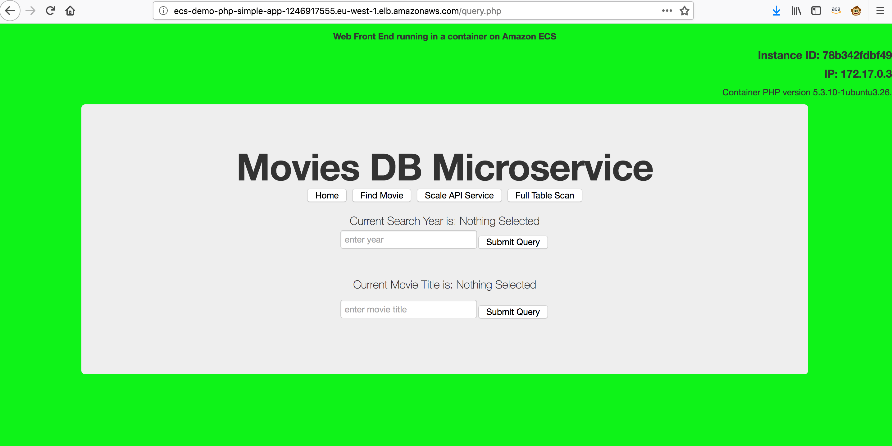
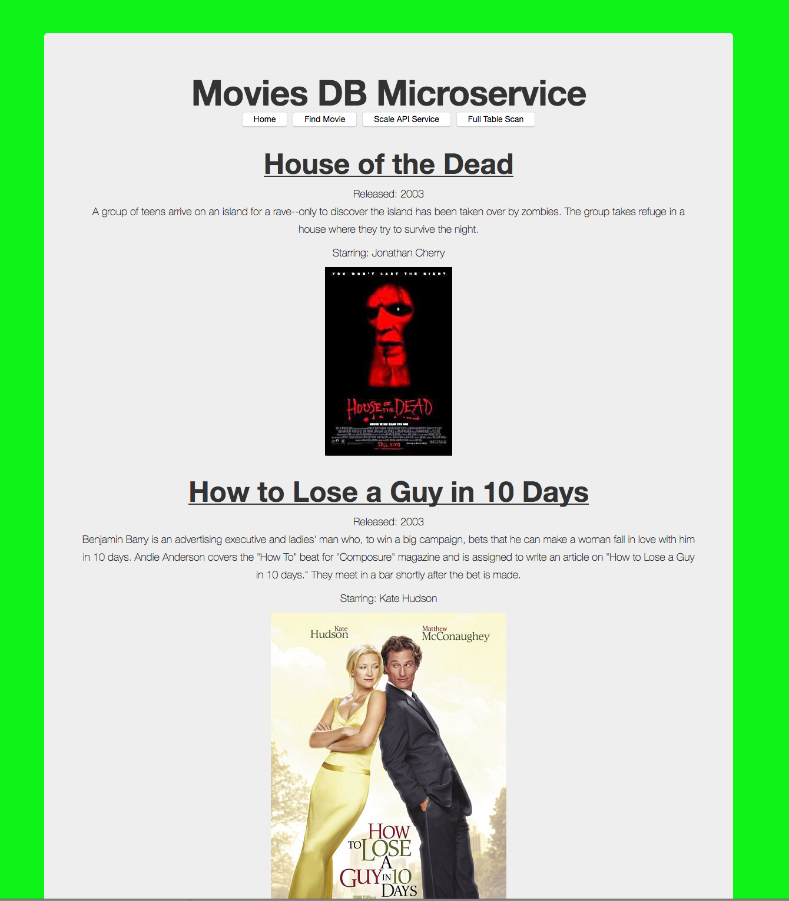

# MasterBuilder Blue/Green deployment of Demo Movie Databse on ECS


This architecture is built upon the [blue green deployments on ECS](https://aws.amazon.com/blogs/compute/bluegreen-deployments-with-amazon-ecs/) and makes use of existing sample data found at https://docs.aws.amazon.com/amazondynamodb/latest/developerguide/GettingStarted.Python.02.html. 

The premise of this solution is that demonstrates how an existing monolithic application can be decomposed into a three tier Microsservice application allowing simple querying of Movie titles from a web interface. 



When deployed the architecture can be used to demonmstrate CI/CD (covered in greater detail below), ECS Scaling options (Fargate vs EC2 ASGs), Service Dicovery options between microservices (Load Balancers, Hosted Zones and Service Discovery Zones) integrated logging and monitoring capabilities via logging and CloiudWatch.

## Application Components are as follows:
1) PHP Web Front End Container - providing simple front end to query the API on EC2 Conatiners
2) Python Flask AP Container - providing API access to the dataset deployed on Fargate containers
3) DynamoDB Database - containing the queried dataset


## Continuous Integration/Deployment
It creates a continuous delivery by leveraging AWS CloudFormation templates. The templates creates resources using Amazon's Code* services to build and deploy containers onto an ECS cluster as long running services. It also includes a manual approval step facilitated by lambda function that discovers and swaps target group rules between 2 target groups, promoting the green version to production and demoting the blue version to staging.

## Pre-Requisites
1) AWS CLI using admin role access key
2) Data Loading requires Python3 and Boto3 installed 


## Quick setup in three steps

#### 1. Fork Demo Movies Sample PHP Web front End app

[Fork](https://help.github.com/articles/fork-a-repo/) the [Amazon ECS sample app](https://github.com/danpt-amzn/ecs-demo-php-simple-app) GitHub repository into your GitHub account.

Clone the ECS Sample app repo 
```console
git clone https://github.com/<your_github_username>/ecs-demo-php-simple-app
```

#### 2. Clone ECS blue green repo

```console
git clone https://github.com/danpt-amzn/ecs-blue-green-deployment
```

#### 3. Run bin/deploy
First ensure the /bin/movies/data-dump bash script is executable 'chmod a+x'

```console
bin/deploy
```

Here are the inputs required to launch CloudFormation templates:
  * **S3 Bucket**: Enter S3 Bucket for storing your CloudFormation templates and scripts. This bucket must be in the same region where you wish to launch all the AWS resources created by this example.
  * **CloudFormation Stack Name**: Enter CloudFormation Stack Name to create stacks
  * **GitHubUser**: Enter your GitHub Username
  * **GitHubToken**: Enter your GitHub Token for authentication ([https://github.com/settings/tokens](https://github.com/settings/tokens))

Scripting will deploy pipleine, ECS Cluster, Load Balancer, DynamoDB Database and Container services.
You can open ELB DNS URL to see the ECS Movies DB App by looking at the output of the Load-Balancer.yaml cloudformation script in the console.

For testing Blue Green deployment, Go ahead and make a change in Movies Sample App ( within your Repo 'ecs-demo-php-simple-app'). For ex, edit src/index.php and update the background-color to #20E941 to change to Green background color. After commiting to your repo, Code Pipeline will pick the change automatically and go through the process of updating your application. 

Click on "Review" button in Code pipeline management console and Approve the change. Now you should see the new version of the application with Green background. 

## Implementation details
The first phase of the scripting deploys the demo movies database on DynamoDB, it then copies the sample dataset into the database.

An ECR Repoistory is then created and a Docker image is then built, tagged and pushed into this repo. This container image is the API backend container that interfaces with the database. It is not currently part of the blue green deployment but will be included in future iterations.

During first phase, the parent template (ecs-blue-green-deployment.yaml) kicks off creating VPC and the resources in deployment-pipeline template.
This creates CodePipeline, CodeBuild and Lambda resources. Once this is complete, second phase creates the rest of resources such as ALB,
Target Groups and ECS resources. Below is a screenshot of CodePipeline once all CloudFormation templates are completed


The templates create two Web Front End services on ECS cluster and associates a Target Group to each service as depicted in the diagram. In addition two instances of the API container service are also deployed, each service is registered against the 'movies.com' discovery service alllowing the web-front end to query against the API containers.

Logging from each container group has also been configured and can be used to drive Alerting and Dashboards through AWS Cloudwatch.

Blue Target Group is associated with Port 80 that represents Live/Production traffic and Green Target Group is associated with Port 8080 and is available for new version of the Application.
The new version of the application can be tested by accessing the load balancer at port 8080, example http://LOAD_BALANCER_URL:8080 .If you want to restrict the traffic ranges accessing beta version of the code, you may modify the Ingress rules [here](https://github.com/awslabs/ecs-blue-green-deployment/blob/master/templates/load-balancer.yaml#L30).
During initial rollout, both Blue and Green service serve same application versions.As you introduce new release, CodePipeline picks those changes and are pushed down the pipeline using CodeBuild and deployed to the Green service. In order to switch from Green to Blue service (or from beta to Prod environment), you have to _Approve_** the release by going to CodePipeline management console and clicking _Review_** button. Approving the change will trigger Lambda function (blue_green_flip.py) which does the swap of ALB Target Groups. If you discover bugs while in Production, you can revert to previous application version by clicking and approving the change again. This in turn will put Blue service back into Production. To simplify identifying which Target Groups are serving Live traffic, we have added Tags on ALB Target Groups. Target Group **IsProduction** Tag will say **true** for Production application.


Here is further explaination for each stages of Code Pipeline.  

**During Build stage**

* During first phase, CodeBuild builds the docker container image and pushes to [Amazon ECR](https://aws.amazon.com/ecr/).
 
* During second phase, Codebuild executes scripts/deployer.py which executes the following scripted logic

  1. Retrieve artifact (build.json) from the previous phase (CodeBuild phase, which builds application container images)
  2. Check if the load balancer exists. Name of the ELB is fed through environment variable by the pipeline.
  3. Get tag key value of the target group, running on port 8080 and 80 with KeyName as "Identifier". It will be either "Code1" or "Code2"
  4. Get Sha of the image id running on target group at port 8080 and 80
  5. Edit the build.json retrieved from step-1 and append the values retrieved in step3 and step4
  6. Save the modified build.json. This file is the output from codebuild project and fed as an input to the CloudFormation
     execution stage.This json file has the following schema
      {
        "Code1" : "CONTAINER_TAG1",
        "Code2" : "CONTAINER_TAG2"
      }
  If the load balancer does not exists (as found in step-2), this would imply that the stack is executed for the first time, and the values of "CONTAINER_TAG1" and CONTAINER_TAG2" will be the same and default to the
  value retrieved from build.json in step-1

**During Deploy stage** 
CodePipeline executes templates/ecs-cluster.yaml. The CloudFormation input parameters with KeyName as "Code1" and "Code2" are overwritten with the values as written in the build.json, retrieved from the second phase of Build Stage.

**During Review stage** 
The pipeline offers manual "Review" button so that the approver can review code and Approve new release.
Providing approvals at this stage will trigger the Lambda function (blue_green_flip.py) which swaps the Green Target Group to Live traffic. You can checkout sample app to see new release change. blue_green_flip.py has the following logic scripted

   1. Read Job Data from input json
   2. Read Job ID from input json
   3. Get parameters from input json
   4. Get Load balancer name from parameters
   5. Identify the TargetGroup running on this Load Balancer at port 80 and port 8080. Perform the TargetGroup Swap. Also swap the values of "IsProduction" tags.
   6. Send success or failure to CodePipeline

## Cleanup
First delete ecs-cluster CloudFormation stack, this will delete both ECS services (BlueService and GreenService) and LoadBalancer stacks. Next delete the parent stack. This should delete all the resources that were created for this exercise 

Note - ECR containers and DynamoDB databases must be manually removed as they not are created by CFN scripting.

## Issues
Note the 'title' query option is dependent on a secondary index being created on the DynamoDB Titles attribute. At time of upload this was not included and must be added manually. This be will added in the future.


